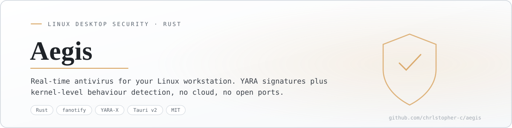
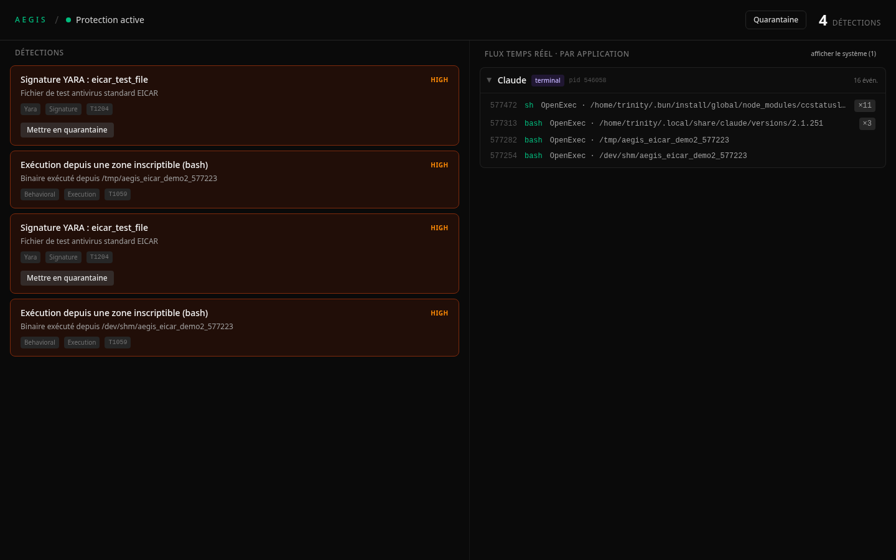
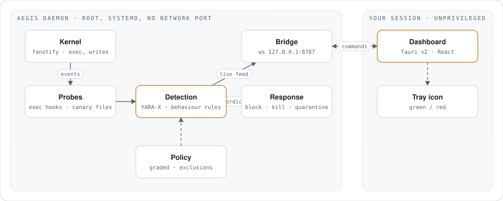
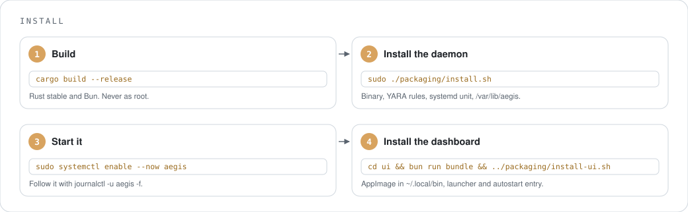
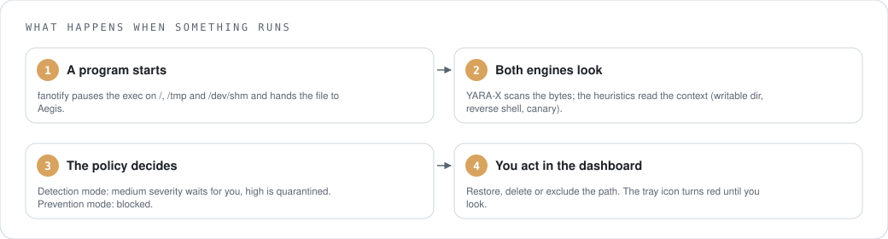
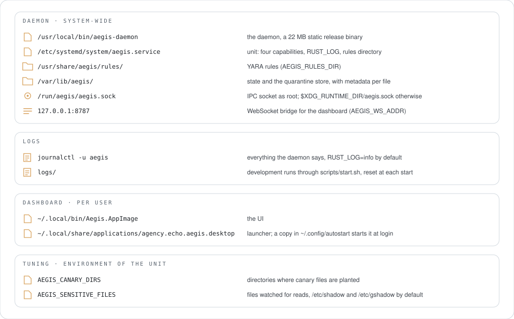
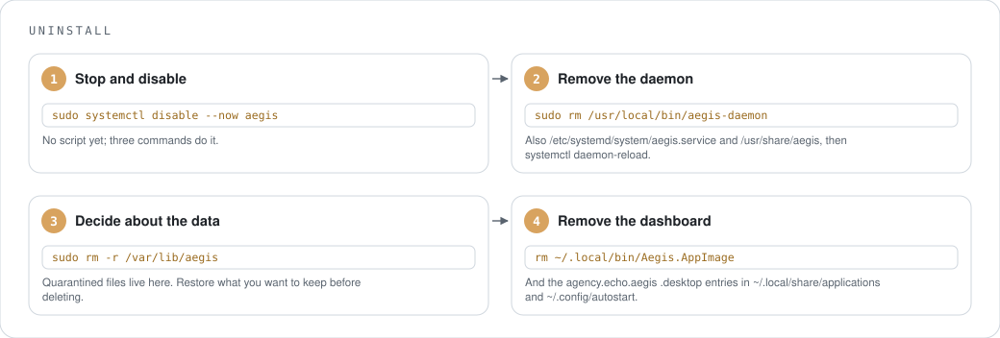
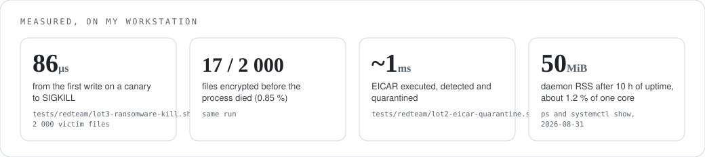
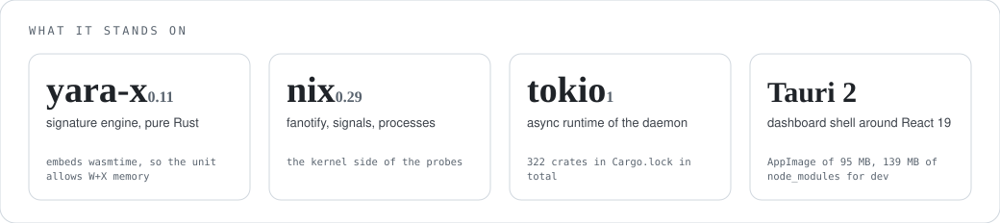

<p align="center">
  <picture>
    <source media="(prefers-color-scheme: dark)" srcset="docs/readme/banner-dark.svg">
    
  </picture>
</p>

<p align="center"><sub>English · <a href="#version-française">Version française</a></sub></p>

# Aegis

Real-time antivirus for a Linux desktop. Two engines in one daemon: YARA signatures, and behaviour detection fed by the kernel through fanotify. It runs on your machine, talks to nothing on the internet, and opens no network port.

> Status: working MVP. Real-time daemon, quarantine, anti-ransomware canaries, dashboard, systemd service. eBPF probes are the next big piece. Last active June 2026.

<p align="center">
  
</p>
<p align="center"><sub>An EICAR test file dropped in <code>/tmp</code> and <code>/dev/shm</code>, then executed. The YARA rule and the "executed from a writable location" heuristic both fire, and the file is quarantined.</sub></p>

## Why I built it

On Linux you choose between ClamAV, which knows signatures and nothing about behaviour, and Kubernetes-grade eBPF tools like Falco or Tetragon that nobody wants to drive from a laptop with YAML. I wanted one program that does both, with a dashboard a human can read, and that never phones home.

## What it does

- Watches every program execution on `/`, `/tmp` and `/dev/shm` through fanotify, and can block it before it runs.
- Scans files and memory with YARA-X rules, the pure Rust build of YARA.
- Catches ransomware with canary files: the first write to a canary kills the writer with SIGKILL.
- Flags reverse shells and binaries launched from writable directories, each mapped to a MITRE ATT&CK id.
- Quarantines automatically above a severity threshold, keeps the metadata, restores on demand.
- Shows everything live in a dashboard grouped by application, with a tray icon that turns red.

## How it works

<p align="center">
  <picture>
    <source media="(prefers-color-scheme: dark)" srcset="docs/readme/how-it-works-dark.svg">
    
  </picture>
</p>

The daemon runs as root under systemd with four capabilities and no network port. The dashboard runs in your session, unprivileged, and only talks to the daemon through the local WebSocket bridge: it receives the live feed and sends commands back. It never touches the filesystem itself.

## Install

<p align="center">
  <picture>
    <source media="(prefers-color-scheme: dark)" srcset="docs/readme/install-dark.svg">
    
  </picture>
</p>

```sh
cargo build --release
sudo ./packaging/install.sh
sudo systemctl enable --now aegis
cd ui && bun run bundle && ../packaging/install-ui.sh
```

Without systemd: `sudo ./scripts/start.sh`. Without root, just to look at the UI: `./target/debug/aegis-daemon --demo`, then `cd ui && bun run dev`.

## Use

<p align="center">
  <picture>
    <source media="(prefers-color-scheme: dark)" srcset="docs/readme/usage-dark.svg">
    
  </picture>
</p>

Two modes, switchable from the dashboard. *Detection* lets programs run and asks you about medium-severity verdicts. *Prevention* blocks the execution while the engines decide. Want to see it catch something? Put the [EICAR test string](https://www.eicar.org/download-anti-malware-testfile/) in a file, make it executable, run it. It is harmless, and every antivirus recognises it.

## Where things live

<p align="center">
  <picture>
    <source media="(prefers-color-scheme: dark)" srcset="docs/readme/files-dark.svg">
    
  </picture>
</p>

## Uninstall

<p align="center">
  <picture>
    <source media="(prefers-color-scheme: dark)" srcset="docs/readme/uninstall-dark.svg">
    
  </picture>
</p>

```sh
sudo systemctl disable --now aegis
sudo rm /usr/local/bin/aegis-daemon /etc/systemd/system/aegis.service
sudo rm -r /usr/share/aegis /var/lib/aegis      # /var/lib/aegis holds the quarantine: restore first if needed
sudo systemctl daemon-reload
rm ~/.local/bin/Aegis.AppImage ~/.local/share/applications/agency.echo.aegis.desktop ~/.config/autostart/agency.echo.aegis.desktop
```

## Measured

<p align="center">
  <picture>
    <source media="(prefers-color-scheme: dark)" srcset="docs/readme/bench-dark.svg">
    
  </picture>
</p>

The red-team scripts in `tests/redteam/` produce the first three numbers against a live daemon. The memory and CPU figures come from the service running on my own workstation; your mileage depends on how many files your programs open.

## What it stands on

<p align="center">
  <picture>
    <source media="(prefers-color-scheme: dark)" srcset="docs/readme/deps-dark.svg">
    
  </picture>
</p>

Also: serde, tracing, tokio-tungstenite for the bridge, ulid for event ids. The dashboard is React 19, TypeScript and Tailwind 4 inside Tauri v2.

## Help

| Symptom | Cause | Fix |
|---|---|---|
| White window instead of the dashboard | WebKitGTK on Wayland with some Nvidia drivers | `WEBKIT_DISABLE_DMABUF_RENDERER=1`. Put it in the `.desktop` file too, the launcher does not inherit your shell. |
| `unknown variant` errors in the UI | the service still runs an older binary than the one you built | `sudo ./packaging/install.sh && sudo systemctl restart aegis` |
| "degraded mode" at startup | not root, so no fanotify | run through systemd or `sudo` |
| `bun run bundle` fails on `.relr.dyn` | linuxdeploy ships a strip too old for that section | the script already sets `NO_STRIP=true`, keep it |
| daemon dies when you harden the unit | yara-x embeds wasmtime, which needs W+X memory | `MemoryDenyWriteExecute` stays off on purpose |

Never build as root. Build as your user, then install with sudo.

Found a detection that looks wrong, or a miss? Open an issue with the `journalctl -u aegis` lines around it and the file involved.

## Where it stands

Works today: fanotify exec hooks, YARA-X scan and quarantine, canaries, exec heuristics, sensitive-file access monitoring, graded policy with exclusions, dashboard and tray.

Not there yet: eBPF probes (fileless execution, privilege escalation, outbound C2 connections), entropy-based ransomware detection beyond canaries, a panel for pending decisions, native notifications, self-protection of the daemon. The UI is in French for now.

Tests: `cargo test` at the workspace root, and the scripts in `tests/redteam/`.

## Project docs

`ARCHITECTURE.md` (domains and module boundaries), `STATE.md` (current state and decisions), `TODO.md` (roadmap), `SECURITY.md`, `ARBORESCENCE.md` (one line per file).

## Licence

MIT. See `LICENSE`.

---

## Version française

Antivirus temps réel pour un poste Linux. Deux moteurs dans un seul daemon : les signatures YARA, et une détection comportementale alimentée par le noyau via fanotify. Il tourne sur ta machine, ne parle à rien sur internet et n'ouvre aucun port réseau.

> État : MVP fonctionnel. Daemon temps réel, quarantaine, canaris anti-ransomware, tableau de bord, service systemd. Les sondes eBPF sont le prochain gros morceau. Dernière activité : juin 2026.

<p align="center">
  
</p>
<p align="center"><sub>Un fichier de test EICAR déposé dans <code>/tmp</code> et <code>/dev/shm</code>, puis exécuté. La règle YARA et l'heuristique « exécuté depuis une zone inscriptible » se déclenchent toutes les deux, et le fichier part en quarantaine.</sub></p>

### Pourquoi

Sous Linux, on a le choix entre ClamAV, qui connaît les signatures et rien du comportement, et des outils eBPF taillés pour Kubernetes comme Falco ou Tetragon, que personne n'a envie de piloter en YAML depuis un portable. Je voulais un seul programme qui fasse les deux, avec un tableau de bord lisible par un humain, et qui ne téléphone jamais à la maison.

### Ce qu'il fait

- Surveille chaque exécution de programme sur `/`, `/tmp` et `/dev/shm` via fanotify, et peut la bloquer avant qu'elle démarre.
- Analyse fichiers et mémoire avec des règles YARA-X, la version Rust pur de YARA.
- Attrape les ransomwares avec des fichiers canaris : la première écriture sur un canari tue le processus avec SIGKILL.
- Repère les reverse shells et les binaires lancés depuis un dossier inscriptible, chacun rattaché à un identifiant MITRE ATT&CK.
- Met en quarantaine automatiquement au-delà d'un seuil de sévérité, conserve les métadonnées, restaure à la demande.
- Affiche tout en direct dans un tableau de bord groupé par application, avec une icône de barre qui passe au rouge.

### Comment ça marche

<p align="center">
  <picture>
    <source media="(prefers-color-scheme: dark)" srcset="docs/readme/how-it-works-dark.svg">
    
  </picture>
</p>

Le daemon tourne en root sous systemd avec quatre capabilities et aucun port réseau. Le tableau de bord tourne dans ta session, sans privilège, et ne parle au daemon que par le pont WebSocket local : il reçoit le flux et renvoie des commandes. Il ne touche jamais lui-même au système de fichiers.

### Installation

<p align="center">
  <picture>
    <source media="(prefers-color-scheme: dark)" srcset="docs/readme/install-dark.svg">
    
  </picture>
</p>

```sh
cargo build --release
sudo ./packaging/install.sh
sudo systemctl enable --now aegis
cd ui && bun run bundle && ../packaging/install-ui.sh
```

Sans systemd : `sudo ./scripts/start.sh`. Sans root, juste pour voir l'interface : `./target/debug/aegis-daemon --demo`, puis `cd ui && bun run dev`.

### Utilisation

<p align="center">
  <picture>
    <source media="(prefers-color-scheme: dark)" srcset="docs/readme/usage-dark.svg">
    
  </picture>
</p>

Deux modes, commutables depuis le tableau de bord. *Détection* laisse les programmes tourner et te demande ton avis sur les verdicts de sévérité moyenne. *Prévention* bloque l'exécution le temps que les moteurs tranchent. Pour le voir attraper quelque chose : mets la [chaîne de test EICAR](https://www.eicar.org/download-anti-malware-testfile/) dans un fichier, rends-le exécutable, lance-le. C'est inoffensif, et tous les antivirus la reconnaissent.

### Où sont les choses

<p align="center">
  <picture>
    <source media="(prefers-color-scheme: dark)" srcset="docs/readme/files-dark.svg">
    
  </picture>
</p>

### Désinstallation

<p align="center">
  <picture>
    <source media="(prefers-color-scheme: dark)" srcset="docs/readme/uninstall-dark.svg">
    
  </picture>
</p>

```sh
sudo systemctl disable --now aegis
sudo rm /usr/local/bin/aegis-daemon /etc/systemd/system/aegis.service
sudo rm -r /usr/share/aegis /var/lib/aegis      # /var/lib/aegis contient la quarantaine : restaure d'abord si besoin
sudo systemctl daemon-reload
rm ~/.local/bin/Aegis.AppImage ~/.local/share/applications/agency.echo.aegis.desktop ~/.config/autostart/agency.echo.aegis.desktop
```

### Mesuré

<p align="center">
  <picture>
    <source media="(prefers-color-scheme: dark)" srcset="docs/readme/bench-dark.svg">
    
  </picture>
</p>

Les scripts red-team de `tests/redteam/` produisent les trois premiers chiffres contre un daemon en service. La mémoire et le CPU viennent du service qui tourne sur mon propre poste ; chez toi, ça dépend du nombre de fichiers que tes programmes ouvrent.

### Sur quoi il repose

<p align="center">
  <picture>
    <source media="(prefers-color-scheme: dark)" srcset="docs/readme/deps-dark.svg">
    
  </picture>
</p>

Et aussi : serde, tracing, tokio-tungstenite pour le pont, ulid pour les identifiants d'événements. Le tableau de bord est en React 19, TypeScript et Tailwind 4 dans Tauri v2.

### Aide

| Symptôme | Cause | Remède |
|---|---|---|
| Fenêtre blanche à la place du tableau de bord | WebKitGTK sous Wayland avec certains pilotes Nvidia | `WEBKIT_DISABLE_DMABUF_RENDERER=1`. Mets-le aussi dans le `.desktop`, le lanceur n'hérite pas de ton shell. |
| Erreurs `unknown variant` dans l'interface | le service tourne encore sur un binaire plus ancien que celui que tu viens de compiler | `sudo ./packaging/install.sh && sudo systemctl restart aegis` |
| « mode dégradé » au démarrage | pas root, donc pas de fanotify | passe par systemd ou `sudo` |
| `bun run bundle` échoue sur `.relr.dyn` | le strip livré avec linuxdeploy est trop vieux pour cette section | le script pose déjà `NO_STRIP=true`, garde-le |
| le daemon meurt quand tu durcis l'unité | yara-x embarque wasmtime, qui a besoin de mémoire W+X | `MemoryDenyWriteExecute` reste désactivé exprès |

Ne compile jamais en root. Compile avec ton utilisateur, puis installe avec sudo.

Une détection qui te semble fausse, ou un raté ? Ouvre une issue avec les lignes de `journalctl -u aegis` autour et le fichier concerné.

### Où ça en est

Marche aujourd'hui : hooks d'exécution fanotify, analyse YARA-X et quarantaine, canaris, heuristiques d'exécution, surveillance des accès aux fichiers sensibles, politique graduée avec exclusions, tableau de bord et icône de barre.

Pas encore là : sondes eBPF (exécution sans fichier, élévation de privilèges, connexions C2 sortantes), détection de ransomware par entropie au-delà des canaris, un panneau pour les décisions en attente, notifications natives, auto-protection du daemon.

Tests : `cargo test` à la racine du workspace, et les scripts de `tests/redteam/`.

### Documentation du projet

`ARCHITECTURE.md` (domaines et frontières de modules), `STATE.md` (état courant et décisions), `TODO.md` (feuille de route), `SECURITY.md`, `ARBORESCENCE.md` (une ligne par fichier).

### Licence

MIT. Voir `LICENSE`.
